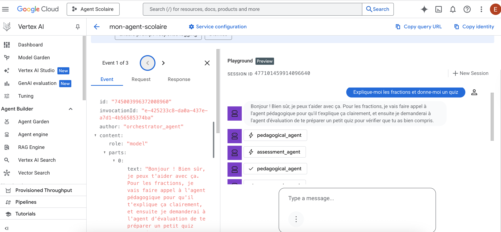

# Multi-Agent School Assistant

> An intelligent assistant for middle school students using multi-agent architecture with Google Vertex AI

[](https://www.python.org/downloads/)
[](LICENSE)
[](https://cloud.google.com/vertex-ai)

## Description

Multi-Agent School Assistant is an intelligent educational assistant designed for middle school students. It uses a **multi-agent architecture** where 5 specialized agents collaborate to provide comprehensive and personalized assistance.

### The 5 Specialized Agents

| Agent | Role | Usage Examples |
|-------|------|----------------|
| 🔍 **Search** | Document retrieval (RAG) | "What is photosynthesis?" |
| 👨‍🏫 **Pedagogical** | Level-adapted explanations | "Explain fractions to me" |
| 📝 **Assessment** | Quiz and exercise creation | "Give me a history quiz" |
| 📅 **Planning** | Organization and methodology | "Help me organize my revision" |
| 🎯 **Orchestrator** | Intelligent coordination | Manages and delegates to other agents |

### Key Features

- **Specialization**: Each agent is an expert in its domain
- **Collaboration**: Agents work together intelligently
- **Quality**: Better responses through specialization
- **Scalable**: Easy to add new specialized agents
- **Maintainable**: Modular and testable architecture

## Architecture Overview

<div align="center">
  
  <p><em>Google Cloud Platform interface showing the multi-agent deployment</em></p>
</div>


### Prerequisites

- Python 3.11+
- [Google Cloud SDK](https://cloud.google.com/sdk/docs/install)
- [uv](https://docs.astral.sh/uv/) (Python package manager)
- A Google Cloud project with Vertex AI enabled

### Setup in 3 Steps

```bash
# 1. Clone the project
git clone https://github.com/your-username/multi-agent-school-assistant.git
cd multi-agent-school-assistant

# 2. Configure Google Cloud (interactive script)
./setup_gcp.sh

# 3. Install and launch
make install && make playground
```

## 💻 Usage

### Web Interface (Playground)

```bash
make playground
```

Opens a Streamlit interface to interact with the agent.

### Code Usage

```python
from app.agent import root_agent

# The orchestrator automatically coordinates the agents
response = root_agent.run_async(
    message="Explain fractions and give me a quiz"
)
```

### Tests

```bash
# Validate the multi-agent architecture
python3 test_multi_agent.py

# Unit and integration tests
make test

# Code verification
make lint
```

## 📁 Project Structure

```
multi-agent-school-assistant/
├── app/
│   ├── multi_agents.py      #  Definition of the 5 agents
│   ├── agent.py              # Main entry point
│   └── agent_engine_app.py   # Deployment configuration
├── docs/                     # Complete documentation
├── tests/                    # Tests
├── notebooks/                # Prototyping notebooks
├── setup_gcp.sh              # Automatic GCP configuration
└── test_multi_agent.py       # Architecture validation
```

## 🛠️ Useful Commands

```bash
make install        # Install dependencies
make reinstall      # Clean reinstall (fixes missing packages)
make verify         # Verify installation
make playground     # Launch web interface
make backend        # Deploy to Vertex AI
make test           # Run tests
make lint           # Check code quality
```

## 🎯 Use Cases

### Example 1: Simple Question
```
Student: "Hello!"
Agent: Responds directly without delegation
```

### Example 2: Explanation
```
Student: "Explain fractions to me"
Agent: Pedagogical Agent → Adapted explanation
```

### Example 3: Test Preparation
```
Student: "I have a math test in a week"
Agent: Search + Pedagogical + Assessment + Planning
       → Complete revision + Quiz + 7-day planning
```

## 📄 License

This project is licensed under Apache 2.0. See [LICENSE](LICENSE) for details.

## 🙏 Acknowledgments

- Project based on [Google Cloud Agent Starter Pack](https://github.com/GoogleCloudPlatform/agent-starter-pack)
- Uses [Google Vertex AI](https://cloud.google.com/vertex-ai) and [Gemini](https://deepmind.google/technologies/gemini/)

---

**⭐ If this project helps you, don't hesitate to star it!**

Made with ❤️ for students
